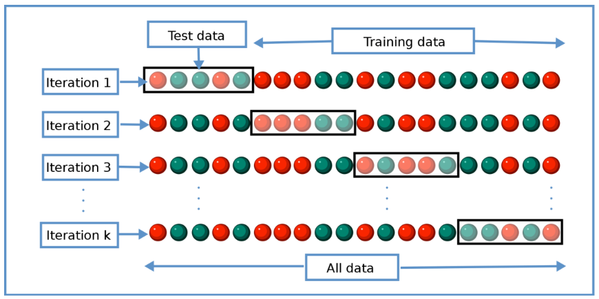

# Maschinelles Lernen

## Bayes Klassifikator

> Entscheidung für wahrscheinlichsten Fall

Wahrscheinlichkeitsbasierte Klassifikation: für geg. Objekt x, ordne x der Klasse mit der höchsten Wahrscheinlichkeit zu.  
Trainingsphase: Wahrscheinlichkeiten müssen angelernt werden
Nutzungsphase: System klassifiziert, kann weiter angelernt werden

$$f(x) = argmax(\prod_{j=0}^{d} P(x_j | y_i)*P(y_i)) | y_i \in Y$$

$x_j \in X$: Nachricht mit Auftreten von Schlüsselwörtern $x_0$ bis $x_d$  
$y_i \in Y$: Klassen (z.B. $Y = \{Spam, Ham\}$)  
$P(y_i)$: Wahrscheinlichkeit für Auftreten von Klasse $y_i$  
$P(x_j | y_i)$: Wahrscheinlichkeit, dass Objekt $x_j$ in Klasse $y_i$ enthalten ist

## Lernbegriff

### Arten des maschinellen Lernens
- unüberwachtes Lernen: Algorithmen zur Aufdeckung versteckter Muster in Daten
- überwachtes Lernen: Algorithmen für Vorhersagen auf unbekannten Daten
- verstärkendes Lernen: Algorithmen interagieren mit einer Umgebung, Lernen durch Belohnungssystem

### Lernaufgaben
- Lernaufgaben legen Ein- und Ausgaben fest: "Entscheide, ob Email m Spam oder Ham ist"
- Eingabedaten sind ein Merkmalsraum $X$ mit einer Dimension $d$, z.B. $x \in X \subseteq R^d$
- Ausgaben $Y$ können z.B. Klassen oder reelle Zahlen sein ($Y = {Spam, Ham}$ oder $Y = \!R$)
- Ziel der Lernaufgabe: Modell der Funktion $f: X \rightarrow Y$ lernen

## Skalentypen

- Nominalskala
    - Zeichensätze, Farben, Gruppen...
    - alle Werte gleichberechtigt
    - =, !=
    - Modus (häufigster Wert): $argmax(x_i) | x_i \in N_{x_i}$
- Ordinalskala
    - Schulnoten, Stufen etc.
    - Rangfolge festgelegt
    - zusätzlich <, >
    - Median (mittlerer Wert): für $X={x_0, x_1, ..., x_k} \rightarrow x_{k/2}$
- Intervallskala
    - Temparaturen in °C oder °F, Zeitangaben (1970)
    - Unterschiede quantifizierbar
    - zusätzlich +, -
    - arithmetisches Mittel: $\frac{1}{k}\sum^k_{i=1}x_i$
- Verhältnisskala
    - Temparaturen (absolut, K), Zeitdauer (2h), Mengenangaben (150g)
    - Nullpunkt wohldefiniert
    - zusätzlich *, /
    - geometrisches Mittel: $\sqrt[k]{\prod_{i=1}^k x_i}$

## Beziehungen

- Adjazenzmatrix zur Beschreibung von Beziehungen zw. Objekten 

A|$o_1$|$o_2$|$o_3$
-|-|-|-
$o_1$|0|1|1
$o_2$|1|0|0
$o_3$|1|0|0

- (Halb-)Ordnungsrelation $\prec$ zur Beschreibung von Rangfolgen
    - Reflexivität: $\forall x: x \prec x$$
    - Antisymmetrie: $\forall x, y: x \prec y \wedge y \prec x \rightarrow x = y$
    - Transitivität: $\forall x, y, z: x \prec y \wedge y \prec z \rightarrow x \prec z$
    - (Totalität: $\forall x, y: x \prec y \vee y \prec x)$
- Beschreibung Ähnlichkeit durch Abstandsfunktion $d: X \times X \rightarrow \!R$
    - Symmetrie: $\forall x, y: d(x, y) = d(y, x)$
    - Positivheit: $\forall x, y: d(x, y) \geq 0$
    - Definitheit: $\forall x, y: d(x, y) = 0 \rightarrow x = y$
    - Dreiecksungleichung: $\forall x, y: d (x, z) \leq d (x, y) + d(y, z)$

## Datenbereinigung

- vertikaler Ausreißer: außerhalb seines Merkmals
- horizontaler Ausreißer: außerhalb seines Objektes
- Satz von Tschebyscheff:
    - Zufallsvariable $Z$ mit Erwartungswert $E(Z)$ und Varianz $Var(Z)$
    - für jedes $c>0$ gilt: $P(|Z-E(Z)|\geq c) \leq\frac{Var(Z)}{c^2}$
- Quantil: $x_p$ heißt $p$-Quantil der Zufallsvariable $Z$, falls $P(Z\leq x_p)\geq p$ und $P(Z\geq x_p) \geq 1-p$
- Faustregeln zur Ausreißererkennung $x_n$:
    - Normalverteilung: $|x_n-\mu|>c*\sigma$
    - Quantilmethode: $x_n\notin[x_{\frac{1}{2}-\frac{p}{2}},x_{\frac{1}{2}+\frac{p}{2}}]$
    - Tschebyscheff: $\frac{|x_n-\mu}{\sigma}>\sqrt{\frac{1}{1-p}}$
    - Lonesome Cowboy: $|x_n - neighbour(x_n)|>d_{max}$

## Datenreduktion

- Reduktion von Objekten (z.B. $o_2$) -> Generalisierung, Clustering, Binning
- Reduktion von Merkmalen (z.B. $m_2$) -> Sampling, Aggregation
- Reduktion von Wertebereichen (z.B. $m_3$) -> Feature Selection

ID|$m_1$|$m_2$|$m_3$| |ID|$m_1$|$m_3$
-|-|-|-|-|-|-|-
o_1|0.1|9.2|+4| |o_1|0.1|high
o_2|0.9|3.4|-1| |o_3|0.6|low
o_3|0.6|0.3|-7

- Binning
    - Unterteilung Wertebereich in Intervalle
    - Zuteilung der Werte zu den Intervallen
- Generalisierung
    - Gruppierung entlang Abstraktionshierarchien
    - Abstraktionshierarchien sind vorgegeben
- Clustering
    - Gruppierung basierend auf Ähnlichkeit
- Aggregation
    - Zusammenfassen mehrerer Objekte mittels Binning oder Generalisierung
    - Ersetzen der Merkmale durch prototypische oder Ordinalwerte

## Datentransformation

Problem: Merkmale werden gleich behandelt, von manchen Merkmalen haben die Werte jedoch größeren Einfluss  

Normierung numerischer Skalen:
- Min-Max-Normierung: $f: x\mapsto\frac{x-x_{min}}{x_{max}-x_{min}}$
- statistische Normierung (z-Normierung): $f: x\mapsto\frac{x-\mu}{\sigma}$
- logarithmus-Transformation: $f: x\mapsto \log_b(x-c)$
- Fisher-Transformation: $f:x\mapsto\frac{1}{2}\log_e(\frac{1+x}{1-x})$

## Regression

- überwachtes Lernen
- Ziel: $f: X\rightarrow y|y=\!R$ (möglichst gute Annäherung an alle $X$ und $y$)

### Lineare Regression

- $f(x)=w_0+w_1*x$
- Fehler durch Mean squared Error (Quadrat wegen Differenzierbarkeit, anders als bei Betrag)  
$$\frac{1}{n}\sum^n_{i=1}(y_i-f(X_i))^2$$
- Trainingsphase:
    - partielle Ableitungen bzgl. $w_0, w_1$ bilden  
    $$\frac{\partial o}{\partial w_0}=\frac{1}{n}\sum^n_{i=1}-2*(y_i-f(x_i))$$  
    $$\frac{\partial o}{\partial w_1}=\frac{1}{n}\sum^n_{i=1}-2x_i*(y_i-f(x_i))$$
    - Beginn bei $w_0=0,w_1=0$
    - Iterative Bestimmung durch $w_0=w_0-\alpha*\frac{\partial o}{\partial w_0}$ und $w_1=w_1-\alpha*\frac{\partial o}{\partial w_1}$

### Logische Regression

Möge Cthulhu mir beistehen...

## Modellbewertung

- Bewertung des Modells $f:X\rightarrow y$: durchschnittlicher Fehler auf den Trainingsdaten
- Unabhängigkeit der Trainings- und Testdaten sicherstellen
- Üblicherweise 80% Trainings- und 20% Testdaten

|| |Trainingsfehler| || 
-|-|-|-|-
 | | |klein|groß
Testfehler|klein|gutes Modell|-
||groß|Überanpassung|Modell lernt nicht

- Überanpassung: Modell zu stark an Trainingsdaten angepasst
- Unteranpassung: Modell nicht speziell genug für Daten
- Bei wenig Daten: Kreuzvalidierung  
  
- Fehlerdarstellung in Konfusionsmatrix  

||$\^y$ positiv|$\^y$ negativ
-|-|-
y positiv | richtig positiv (TP) | falsch negativ (FN)
y negativ | falsch positiv (FP)  | richtig negativ (TN)

- $\rightarrow$ Summe der Vorhersagen ist korrekt
- Sensitivität (Recall): $R=\frac{TP}{TP+FN}$
- Präzision (Precision): $P=\frac{TP}{TP+FP}$
- Spezifizität (Specificity): $S=\frac{TN}{TN+FP}$
- Genauigkeit (Accuracy): $A=\frac{TP+TN}{TP+FP+TN+FN}$
- $F_1$-Score: $F_1=2*\frac{P*R}{P+R}$

## Neuronale Netze: Perzeptron

$$
x=\begin{bmatrix}x_1\\x_2\\...\\x_d\end{bmatrix}\in\!R^d
\qquad
w=\begin{bmatrix}w_1\\w_2\\...\\w_d\end{bmatrix}\in\!R^d
\qquad
y\in \{0,1\}
$$
- Verarbeitung
    - Berechnung Roheingabe  
    $$\sum^d_{i=1}w_i*x_i=w^T*x$$
    - Berechnung der Aktivierungsfunktion des Ausgabeneurons ($\theta$: Schwellwert)
    $$\^y=\begin{cases}1|w^T*x\ge \theta\\0\end{cases}
- Bias-Neuron: Verschieben den Schwellwert von der Aktivierungsfunktion zur Roheingabe
    - Erweitern der Eingabevektoren um ein $x_0=1$ mit Gewicht $w_0=-\theta$
    - Dadurch kann in der Aktivierungsfunktion als Schwellwert immer $0$ verwendet werden
- Trainingsphase
    - Anpassung durch (Lernrate $\alpha\in[0,1]$)
    $$w_j=w_j+\Delta w_j\qquad\Delta w_j=\alpha*(y_i-\^y_i)*x_{ij}\qquad\text{Bias-Neuron: }\Delta w_0=\alpha*(y_i-\^y_i)$$

## Feed-Forward Netze

- Verbinden mehrerer Perceptrons
- Neutron der Schicht $k$ darf nur Kanten zu Neuronen der Schicht $k+1$ haben
- Aktivierungsfunktion $g(x)$ muss gewählt werden (wir nutzen zunächst $g(x)=x$)

$$
w^1=\begin{bmatrix}
    w^1_{1,1} & w^1_{1,2}\\
    w^1_{2,1} & w^1_{2,2}\\
    w^1_{3,1} & w^1_{3,2}\\
\end{bmatrix}
\qquad
x=\begin{bmatrix}x_1\\x_2\end{bmatrix}
\qquad
\begin{bmatrix}z^1_1\\z^1_2\\z^1_3\end{bmatrix} = z^1 = w^1*x
\qquad
g(x) = x
\qquad
g(z^1) = a^1=\begin{bmatrix}a^1_1\\a^1_2\\a^1_3\end{bmatrix}
$$
$$
w^2=\begin{bmatrix}
    w^1_{1,1} & w^1_{1,2} & w^1_{1,3}\\
    w^1_{2,1} & w^1_{2,2} & w^1_{2,3}\\
\end{bmatrix}
\qquad
\begin{bmatrix}z^2_1\\z^2_2\end{bmatrix} = z^2 = w^2*a^1
\qquad
g(z^2) = y = \begin{bmatrix}y_1\\y_2\end{bmatrix}
$$